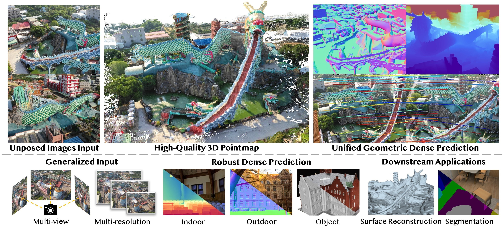

# Dens3R
### [[Paper]](https://arxiv.org/pdf/2507.16290) [[Project Page]](https://g-1nonly.github.io/Dens3R/)

> [**Dens3R: A Foundation Model for 3D Geometry Prediction**](https://g-1nonly.github.io/Dens3R/),            
> Xianze Fang<sup>1*</sup>, [Jingnan Gao<sup>2*</sup>](https://g-1nonly.github.io), Zhe Wang<sup>1</sup>, Zhuo Chen<sup>2</sup>, [Xingyu Ren<sup>2</sup>](https://xingyuren.github.io), Jiangjing Lyu<sup>1†</sup>, Qiaomu Ren<sup>1</sup>, Zhonglei Yang<sup>1</sup>, [Xiaokang Yang<sup>2</sup>](https://english.seiee.sjtu.edu.cn/english/detail/842_802.htm), [Yichao Yan<sup>2‡</sup>](https://daodaofr.github.io/), Chengfei Lyu <br>
> **<sup>1</sup> Alibaba Group <sup>2</sup> Shanghai Jiao Tong University** <br>
> *Equal contribution  † Project leader  ‡ Corresponding author

Official implementation of "Dens3R: A Foundation Model for 3D Geometry Prediction".

<div align="center">
  
</div><br/>


## 🔧 Installation
### 1. Clone & Install Dependencies of Dens3R
#### 1.1 Prepare Python Environment
> **Note**: We use python 3.10.13 and CUDA 11.8. Other versions of cuda and python should be compatible. If your CUDA version is not 11.8, please replace the lines below with proper versions of torch and torchvision in <requirements.txt> before installing. We do not require specific torch and torchvision versions so other torch versions should be compatible.

```bash
# Replace the lines below in 'requirements.txt' with your own versions of torch and torchvision
# torch==2.7.1+cu118
# torchvision==0.22.1+cu118

# install dependencies
git clone https://github.com/alibaba/Taobao3D.git -b Dens3R
conda create -n dens3r python=3.10.13
conda activate dens3r
pip install -r requirements.txt

# download checkpoints
TODO: The open-sourcing of the model ckpt is currently under approval.
```

#### 1.2 Install COLMAP[Required]
We require COLMAP for reconstruction. Please follow the official [guidance](https://colmap.github.io/install.html) to install COLMAP.

#### 1.3 Install GLOMAP[Optional]
GLOMAP is optional in our project. GLOMAP can speedup the reconstruction process compared with using COLMAP. Please follow the official [Repo](https://github.com/colmap/glomap) to install GLOMAP. Note that COLMAP is required for installing GLOMAP.


### 2. [Optional] Install Dependencies of AutoRecon

> **Note**: We modified the [official AutoRecon](https://github.com/zju3dv/AutoRecon) to support automated SDF reconstruction of an object. The modified version of AutoRecon is contained in our repo. We delete all the submodule of the official AutoRecon so the '--recursive' command is not neccessary.

#### 2.1 Install Dependencies of AutoRecon

Install tiny-cuda-nn
```bash
pip install git+https://github.com/NVlabs/tiny-cuda-nn/#subdirectory=bindings/torch
```

Install faiss following the official guide
```bash
# for example
conda install -c conda-forge faiss-gpu
```

Install AutoRecon
```bash
cd AutoReconForDens3R
pip install -e .
```

## 🚀 Usage
### Infer normal/depth of an image sequence
```bash
# example
python infer/infer_normal_pts3d.py \
  --model_path path/to/model/checkpoint \
  --img_dir path/to/images/folder \
  --save_dir path/to/save/folder \
  --pair_mode self \
  --size 512
```
<details>
<summary>[Arguments Explanation - click to expand]</summary>

 * `model_path`: The path to the Dens3R model checkpoint.
 * `--img_dir`: The path to the images folder.
 * `--save_dir`: The path to the folder to save the results.
 * `--pair_mode`: Choose in [self, near, sequence]. self: an image paired with itself. near: an image paired with its nearby image. sequence: an images paired with more than 3 images in order to get averaged results.
</details>

### Reconstruct pose and pointcloud of an image sequence
```bash
# example
python infer/dens3r_recon.py \
  --img_dir path/to/images/folder \
  --output_dir path/to/save/results \
  --model_path path/to/model/checkpoint
```
<details>
<summary>[Arguments Explanation - click to expand]</summary>

 * `--img_dir`: path to images folder.
 * `--output_dir`: path to save results.
 * `-model_path`: path to Dens3R model checkpoint.
 * `--triangulate_from_pose`: path to the pre-computed COLMAP-format pose of the images. Default is None. If set, the dens3r_recon.py will not estimate pose and use the pre-computed pose to triangulate instead.
 * `--matching_mode`: {exhaustive,sequential} exhaustive or sequential pairwise matching mode. Default is exhaustive.
 * `--window_size`: If matching_mode is sequential, window_size is the window size for sequential matching. Default is 30.
 * `--size`: Infer resolution. Default 512. Set to 1024 or higher for better normal and depth estimation.
 * `--use_mapper`: {colmap,glomap}.
 * `--camera_model`: Camera model define in COLMAP, default is SIMPLE_RADIAL.
 * `--conf_thr`: Confidence threshold for matching, default is 1.001. Suggested unchanged.
 * `--pixel_tol`: Pixel tolerance for matching, default is 5. Suggested unchanged.
 * `--subsample`: Pixel subsample factor for matching, default is 8. Suggested 4 or 8.
</details>


### Automated 3D Reconstruction of an image sequence Using AutoRecon
Please refer to the shell script in `AutoRecon_Dens3R/exps/code-release/run_dens3r_recon.sh`. <br>
The process contains 3 steps:<br>
1) Reconstruct the poses and the pointcloud of the image sequence. Also predict the normalmaps of the images for step 2 usage.
2) Reconstruct the SDF using AutoRecon (Based on NeuS).
3) Extract the mesh from SDF using Marching Cubes.


## 🙏 Acknowledgements
Our work builds upon several fantastic open-source projects. We'd like to express our gratitude to the authors of:
  * [DUSt3R](https://github.com/naver/dust3r)
  * [MASt3R](https://github.com/naver/mast3r)


## 📚 Citation
```bibtex
@article{dens3r,
  title={Dens3R: A Foundation Model for 3D Geometry Prediction}, 
  author={Xianze Fang and Jingnan Gao and Zhe Wang and Zhuo Chen and Xingyu Ren and Jiangjing Lyu and Qiaomu Ren and Zhonglei Yang and Xiaokang Yang and Yichao Yan and Chengfei Lyu},
  journal={arXiv preprint arXiv:2507.16290},
  year={2025}
}
```