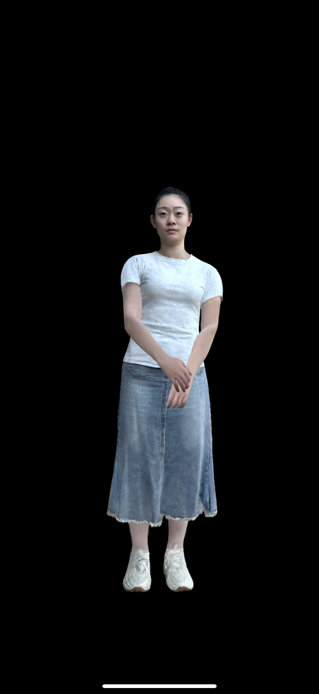
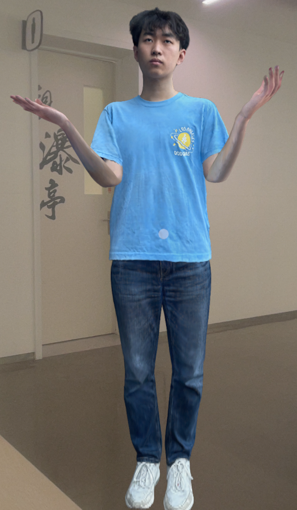

# HRM2Avatar (Runtime Code)

## 1. Overview

This repository provides the runtime implementation for the [HRM2Avatar paper](https://acennr-engine.github.io/HRM2Avatar/): a novel framework for creating high-fidelity avatars from monocular phone scans, which can be rendered and animated in real-time on mobile devices.

This runtime is a simplified reimplementation of the system used in the paper. The core algorithms, model formats, and rendering pipelines are faithfully reproduced to match the paper's performance and visual quality. It contains：
- A complete gaussian rendering pipeline implemented with metal-cpp
- Animation curve and animation player components
- Skeletal skinning and BlendShape animation computation
- Shadow and vertex offset neural-network compensation
- Native windows built with SwiftUI
- Supported platforms: iOS, visionOS, macOS

## 2. Environment

Dependencies:
- Xcode 16.4 with iOS and/or visionOS SDKs installed
- CMake 3.29
- Python 3.9
- Git

Make Project:
```bash
# 1) Clone and enter the project
git clone --recurse-submodules https://github.com/alibaba/Taobao3D.git -b HRM2Avatar
cd Taobao3D

# 2) Generate Xcode projects
# macOS (development shell)
python3 ./scripts/python/make_project.py --platform osx

# iOS (device/simulator)
python3 ./scripts/python/make_project.py --platform ios

# visionOS (device/simulator)
python3 ./scripts/python/make_project.py --platform visionos
```

Run Project:
```bash
# 3) Open in Xcode and run
open build/osx/HRM2Avatar.xcodeproj   # or build/ios, build/visionos accordingly
```
After generation, open the Xcode project under `build/<platform>/HRM2Avatar.xcodeproj`, select the `avatar-<platform>` target and the desired device, and run the project. For best performance, prefer the **Release** configuration.

To switch between different avatar assets, modify the `LoadGaussianModel("asset-name")` call in the source code with the desired asset directory name (e.g., `hrm2-model-test` or `hrm2-model-2`).

Shader Recompilation:

If you need to change HLSL shaders and recompile, clone the [ShaderConductor](https://github.com/microsoft/ShaderConductor/tree/v0.3.0) sources and apply the following additional settings before building its CLI tools.

1) Pin dependency revisions in its CMake config:
```cmake
set(DirectXShaderCompiler_REV "002ed9737e389cebbefd1e8376bff6ad8a642340")
set(SPIRV_Cross_REV           "1ad1662a2b4a41ed0076750b0cc2732cb89a19e8")
set(SPIRV_Headers_REV         "f8bf11a0253a32375c32cad92c841237b96696c0")
set(SPIRV_Tools_REV           "fd773eb50d628c1981338addc093df879757c2cf")
```

2) Adjust target and compiler options in ShaderConductor sources:
```cpp
targetDesc.asModule = false;
targetDesc.version = "20300";
Compiler::Options optionDesc;
optionDesc.packMatricesInRowMajor = false;
optionDesc.shaderModel.major_ver = 6;
optionDesc.shaderModel.minor_ver = 2;
optionDesc.enable16bitTypes = true;
// DXC extra flags
dxcArgStrings.push_back(L"-fspv-target-env=universal1.5");
```

Build ShaderConductor following its official process to obtain the CLI tools. Use those tools during development to translate HLSL into the target shading language (e.g., MSL) before integrating into the app.

## 3. Demos

### 3.1 iOS

| hrm2-model-test | hrm2-model-2 |
|:---------------:|:------------:|
|  |  |

### 3.2 visionOS

| hrm2-model-test | hrm2-model-2 |
|:---------------:|:------------:|
|  |  |

## 4. Performance
The performance data reported in the paper is based on **hrm2-model-test**, with 533K Gaussian points.

- **iPhone 15 Pro Max**(A17 Pro): 2048×945@120FPS, total 8.18ms, 5.74ms rendering, 0.94ms sorting, 1.42ms projection, 0.08ms others
- **Apple Vision Pro**(M2): 1920×1824x2@90FPS, total 8.38ms, 6.44ms rendering, 0.71ms sorting, 1.12ms projection, 0.11ms others

## 5. Project Layout
```
hrm2Avatar/
├─ CMakeLists.txt               # Root CMake, orchestrates per-platform projects
├─ assets/                      # Resources and shaders
│  ├─ hrm2-model-test/          # Test data: mesh/gaussians/MNN weights, descriptors
│  └─ shaders/                  # Metal/HLSL shaders
├─ platforms/                   # Platform shells (Swift/SwiftUI)
│  ├─ ios/
│  ├─ macos/
│  └─ visionos/
├─ scripts/
│  └─ python/make_project.py    # Helper to generate Xcode projects
├─ src/                         # Rendering/animation core (C++/ObjC++)
│  ├─ animation/                # Curves, player, blend-shape utilities
│  ├─ bridge/                   # Swift bridging, Metal helpers
│  ├─ graphics/                 # Buffer/Pipeline/Shader abstractions
│  ├─ neural_network/           # Lightweight MNN inference (pose/illumination)
│  ├─ renderer/                 # Drawable, Gaussian assets, mesh, renderer
│  └─ utils/                    # Asset loader, types, timer, logging
└─ third/                       # Third-party sources/headers
   ├─ metal-cpp/
   ├─ mnn/
   └─ nlohmann-json/
```

## 6. References and Acknowledgments

### References
- [metal-cpp](https://developer.apple.com/metal/cpp/): Apple's Metal C++ headers and wrappers; used to drive the Metal pipeline directly from C++.
- [nlohmann-json](https://github.com/nlohmann/json/tree/v3.12.0): Modern C++ JSON library.
- [MNN (Alibaba MNN)](https://github.com/alibaba/MNN/tree/3.2.5): A highly efficient and lightweight deep learning framework.
- [ShaderConductor](https://github.com/microsoft/ShaderConductor/tree/v0.3.0): A tool designed for cross-compiling HLSL to other shading languages.
- [UnityGaussianSplatting](https://github.com/aras-p/UnityGaussianSplatting): Unity implementation of Gaussian splatting.

### Acknowledgments
We gratefully acknowledge the authors and maintainers of `metal-cpp`, `MNN`, `nlohmann-json`, `ShaderConductor`, and `UnityGaussianSplatting`. This runtime implements the methods described in the HRM2Avatar paper while relying on the above open-source projects for essential infrastructure and algorithmic references.

## 7. Troubleshooting

- If you encounter issues, first verify the dependencies listed in the **Environment** section, then re-run the project setup and build steps.
- If performance does not meet expectations:
   - Make sure the **Release** configuration is enabled.
   - Ensure you are using **iPhone 15 Pro Max**(A17 Pro) or a more powerful device.

## 8. License
This project is licensed under the Apache License 2.0. See `LICENSE` for details.
