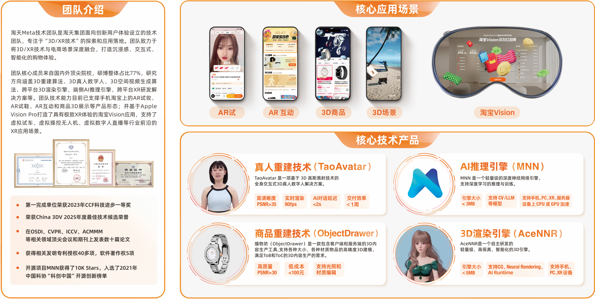

    

# Introduction
We are the TaoTian Meta Technology Team(**淘天Meta技术团队**), dedicated to advancing and applying 3D and XR technologies. Our work spans:
- 3D object reconstruction
- 3D human reconstruction, editing and animation 
- Cross‑platform 3D rendering engines
- On‑device AI inference engines([MNN](https://github.com/alibaba/MNN)) 
- Comprehensive cross‑platform XR development solutions

We aim to deliver high‑performance, scalable solutions that enable next‑generation digital experiences.

# 🔥 News
- Feb 21, 2026: We have 5 papers(MoRE, VIAFormer, LoG3D, MatMart, FHAvatar) accepted by CVPR 2026! Congrats to all the authors!
- Jan 26, 2026: We have 1 paper(Dens3R) accepted by ICLR 2026!

# Publications
📷 **3D Reconstruction and Generation**
- VIAFormer: Voxel-Image Alignment Transformer for High-Fidelity Voxel Refinement.(**CVPR 2026**) [[Paper]](https://arxiv.org/abs/2601.13664)
- LoG3D: Ultra-High-Resolution 3D Shape Modeling via Local-to-Global Partitioning.(**CVPR 2026**) [[Paper]](https://arxiv.org/abs/2511.10040)
- MatMart: Material Reconstruction of 3D Objects via Diffusion.(**CVPR 2026**) [[Paper]](https://arxiv.org/abs/2511.18900)
- MoRE: 3D Visual Geometry Reconstruction Meets Mixture-of-Experts.(**CVPR 2026**) [[Paper]](https://arxiv.org/abs/2510.27234) [[Project Page]](https://g-1nonly.github.io/MoRE_Website/) [Code]
- Dens3R: A Foundation Model for 3D Geometry Prediction.(**ICLR 2026**) [[Paper]](https://arxiv.org/abs/2507.16290) [[Project Page]](https://g-1nonly.github.io/Dens3R/) [[Code]](https://github.com/alibaba/Taobao3D/tree/Dens3R)

🙎 **3D Human / Avatar Modeling and Animation**
- FHAvatar: Fast and High-Fidelity Reconstruction of Face-and-Hair Composable 3D Head Avatar from Few Casual Captures.(**CVPR 2026**) [[Paper]](https://arxiv.org/abs/2603.23345)
- TaoAvatar: Real-Time Lifelike Full-Body Talking Avatars for Augmented Reality via 3D Gaussian Splatting (**CVPR 2025 Hightlight**). [[Paper]](https://arxiv.org/abs/2503.17032) [[Project Page]](https://pixelai-team.github.io/TaoAvatar/) [[Demo Code]](https://github.com/alibaba/MNN/blob/master/apps/Android/MnnTaoAvatar/README.md)
- HRM2Avatar: High-Fidelity Real-Time Mobile Avatars from Monocular Phone Scans (**SIGGRAPH Asia 2025**). [[Paper]](https://arxiv.org/pdf/2510.13587) [[Project Page]](https://acennr-engine.github.io/HRM2Avatar/) [[Code]](https://github.com/alibaba/Taobao3D/tree/HRM2Avatar)

# Join Us
We are expanding our team and looking for talents passionate about 3D vision, graphics, and AI.

| Job Name     | Job Type | Link |
| :-----------: | :-----------: | :-----------: |
| 研究型实习生-三维重建和3D模型生成方向        | Intern       | [link](https://campus-talent.alibaba.com/campus/position/199903900065?deptCodes=T8B7EB) |
| 研究型实习生-端侧LLM加速&语音大模型加速方向| Intern |  [link](https://campus-talent.alibaba.com/campus/position/199903880041?deptCodes=T8B7EB) |
| T-Star实习生-3D重建大模型    | Intern       | [link](https://campus-talent.alibaba.com/campus/position/199903920039?deptCodes=T8B7EB) |
| T-Star实习生-大语言模型 | Intern | [link](https://campus-talent.alibaba.com/campus/position/199903820039?deptCodes=T8B7EB) |
| 正式员工-大语言模型算法工程师    | Full-time    | [link](https://talent.taotian.com/off-campus/position-detail?lang=zh&positionId=7000043123) |