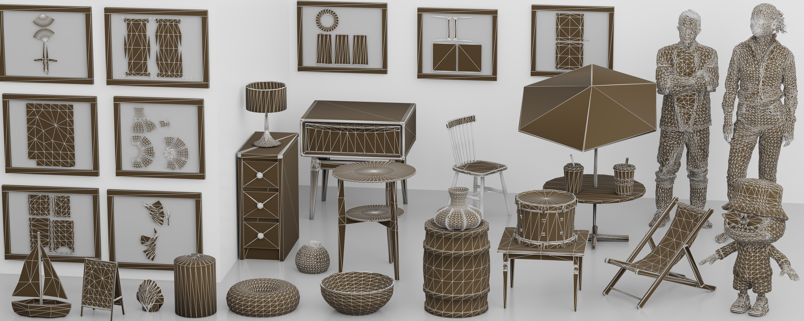

<p align="center">
  <strong>TaoFlowForge: Progressive Native Mesh Generation via Cascaded Flow Matching</strong>
</p>

<p align="center">
  <a href="https://arxiv.org/pdf/2609.37139"></a>
  <a href="https://alibaba.github.io/Taobao3D/blog/taoflowforge/"></a>
</p>

<p align="center">
  
</p>

## Introduction

TaoFlowForge is a model for image-conditioned, production-ready native mesh generation. Instead of representing 3D shapes through an intermediate format, it progressively generates mesh vertices and predicts their connectivity to produce lightweight, editable, and topologically clean triangle meshes.

The method uses a fixed three-stage pipeline:

1. **Stage 0: Coarse occupancy generation.** The input image is converted into occupied cells on a `64³` grid.
2. **Stage 1: Fine vertex generation.** A Level-MoE model progressively refines the coarse structure into vertices on a `512³` lattice.
3. **Stage 2: Topology generation.** The model predicts connectivity affinities and decodes triangle faces; mesh post-processing repairs holes and face orientations.

TaoFlowForge achieves state-of-the-art results among open-source mesh topology generators under image-conditioned generation. See the full paper: [TaoFlowForge: Progressive Native Mesh Generation via Cascaded Flow Matching](https://arxiv.org/pdf/2609.37139).

This repository provides the inference pipeline, command-line interface, Python API, and Gradio demo.

## Requirements and Installation

The code is tested with:

- Python 3.10
- PyTorch 2.5.1
- CUDA 12.1

Create an environment and install the pinned dependencies:

```bash
conda create -n taoflowforge python=3.10 -y
conda activate taoflowforge
pip install -r requirements.txt
```

Some CUDA packages depend on the local GPU architecture and CUDA runtime. If a pinned binary wheel is incompatible with your system, install the corresponding build for your PyTorch/CUDA environment.

## Checkpoints

Prepare the five released checkpoint files. Paths may be changed freely as long as the matching CLI arguments are provided.

```text
weights/
├── stage0.pt
├── stage0_vae.pt
├── stage0_latent_norm.pt
├── stage1.pt
└── stage2.pt
```

Checkpoint loading is strict: model keys, tensor shapes, and release architecture metadata must match the expected configuration.

## Full Pipeline Inference

Run the complete image-to-mesh pipeline with:

```bash
python -m taoflowforge.cli run \
  --image path/to/input.png \
  --stage0-checkpoint weights/stage0.pt \
  --stage0-vae-checkpoint weights/stage0_vae.pt \
  --stage0-latent-norm weights/stage0_latent_norm.pt \
  --stage1-checkpoint weights/stage1.pt \
  --stage2-checkpoint weights/stage2.pt \
  --output-dir output/example \
  --seed 42
```

By default, models are moved on and off the GPU stage by stage to reduce peak memory usage. Use `--offload off` to keep available modules resident, or `--no-fill-holes` to preserve the raw Stage 2 topology without hole filling and normal repair.

The output directory contains:

```text
output/example/
├── input.png
├── stage0.npz
├── stage1.npz
├── stage2.npz
├── mesh_raw.obj
├── mesh.obj
├── mesh.glb
└── metadata.json
```

`mesh_raw.obj` is the direct Stage 2 prediction, `mesh.obj` is the repaired final mesh, and `mesh.glb` is centered and scaled to fit within `[-0.5, 0.5]³` for visualization.

### Stage-wise Inference

Each stage can also be run independently. The intermediate NPZ files preserve NumPy, CPU Torch, and CUDA RNG states.

```bash
# Stage 0: image -> occupied cells
python -m taoflowforge.cli stage0 \
  --image path/to/input.png \
  --stage0-checkpoint weights/stage0.pt \
  --stage0-vae-checkpoint weights/stage0_vae.pt \
  --stage0-latent-norm weights/stage0_latent_norm.pt \
  --output-artifact output/stage0.npz --seed 42

# Stage 1: occupied cells -> vertices
python -m taoflowforge.cli stage1 \
  --image path/to/input.png \
  --stage1-checkpoint weights/stage1.pt \
  --input-artifact output/stage0.npz \
  --output-artifact output/stage1.npz

# Stage 2: vertices -> triangle mesh
python -m taoflowforge.cli stage2 \
  --image path/to/input.png \
  --stage2-checkpoint weights/stage2.pt \
  --input-artifact output/stage1.npz \
  --output-artifact output/stage2.npz \
  --output-mesh output/mesh_raw.obj
```

The full command can resume from a saved artifact with `--resume-from path/to/stage1.npz`. Restoring a CUDA artifact requires the same number of visible CUDA devices used when it was created.

## Python API

```python
from pathlib import Path

from taoflowforge import InferenceConfig, Stage0Config, Stage1Config, Stage2Config
from taoflowforge.pipeline import TaoFlowForgePipeline

weights = Path("weights")
config = InferenceConfig(
    stage0=Stage0Config(
        checkpoint=weights / "stage0.pt",
        vae_checkpoint=weights / "stage0_vae.pt",
        latent_norm=weights / "stage0_latent_norm.pt",
    ),
    stage1=Stage1Config(checkpoint=weights / "stage1.pt"),
    stage2=Stage2Config(checkpoint=weights / "stage2.pt"),
    seed=42,
    output_dir=Path("output/example"),
)

with TaoFlowForgePipeline.from_config(config) as pipeline:
    result = pipeline.run("examples/bookshelf_desk.png")

print(result.glb_path)
```

A directly runnable example is available at `examples/minimal_inference.py`.

## Gradio Demo

Launch the interactive web interface with:

```bash
python gradio_demo.py \
  --stage0-checkpoint weights/stage0.pt \
  --stage0-vae-checkpoint weights/stage0_vae.pt \
  --stage0-latent-norm weights/stage0_latent_norm.pt \
  --stage1-checkpoint weights/stage1.pt \
  --stage2-checkpoint weights/stage2.pt \
  --device cuda:0 \
  --host 0.0.0.0 \
  --port 7860
```

The demo runs the complete three-stage pipeline and progressively displays the Stage 0 occupancy point cloud, Stage 1 vertex cloud, and Stage 2 triangle topology. Intermediate files and final results are stored in a temporary directory named `/tmp/taoflowforge-*`. Use `--share` to request a public Gradio link.

## Citation

If you find TaoFlowForge useful in your research, please cite:

```bibtex
@misc{fang2026taoflowforge,
  title         = {TaoFlowForge: Progressive Native Mesh Generation via Cascaded Flow Matching},
  author        = {Fang, Xianze and Feng, Qiyuan and Sun, Dongfang and Zhang, Yan and Wu, Xiuchao and Gao, Jingnan and Lyu, Jiangjing and Lyu, Chengfei and Yu, Gang},
  year          = {2026},
  eprint        = {2609.37139},
  archivePrefix = {arXiv},
  primaryClass  = {cs.CV},
  doi           = {10.48550/arXiv.2609.37139},
  url           = {https://arxiv.org/abs/2609.37139}
}
```
