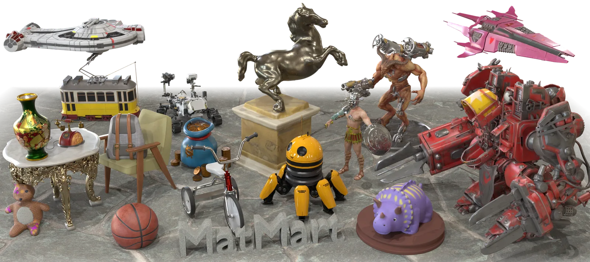
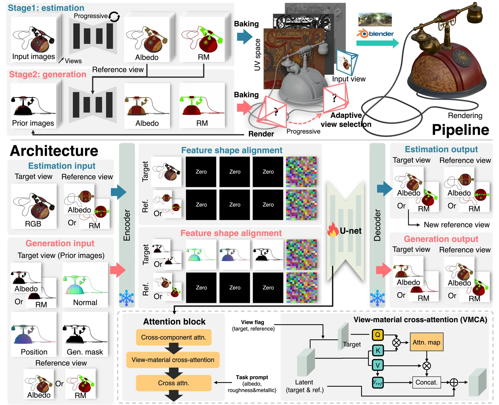
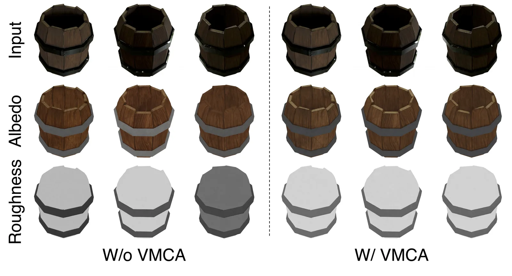
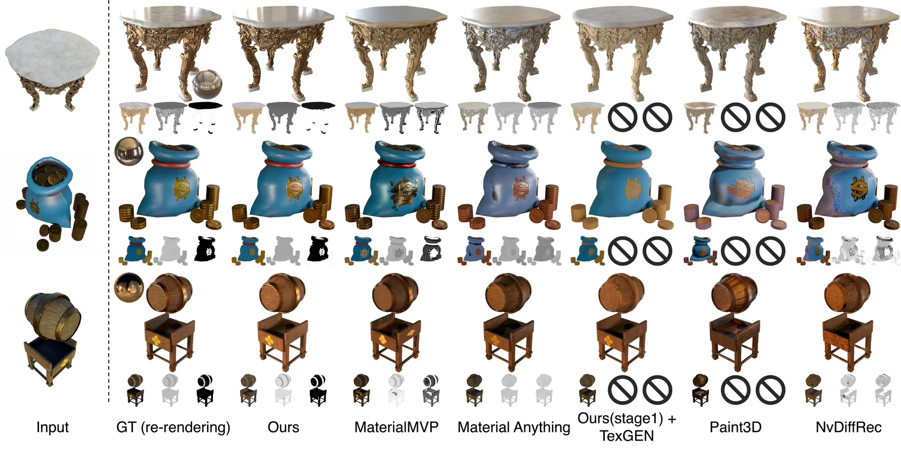
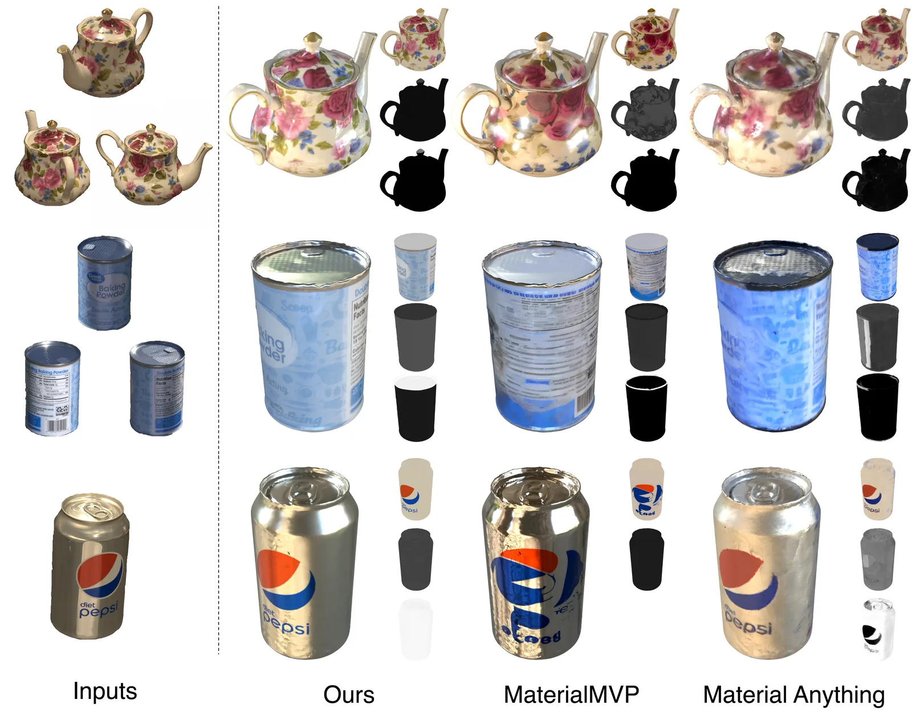
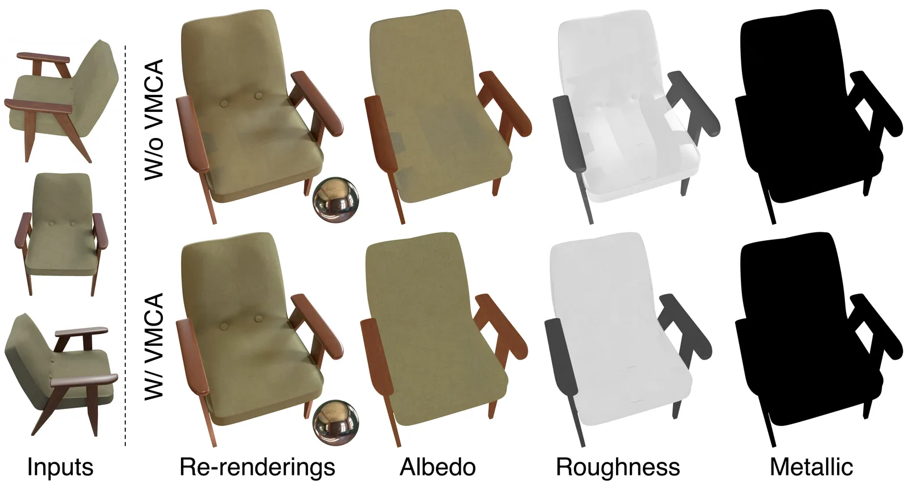
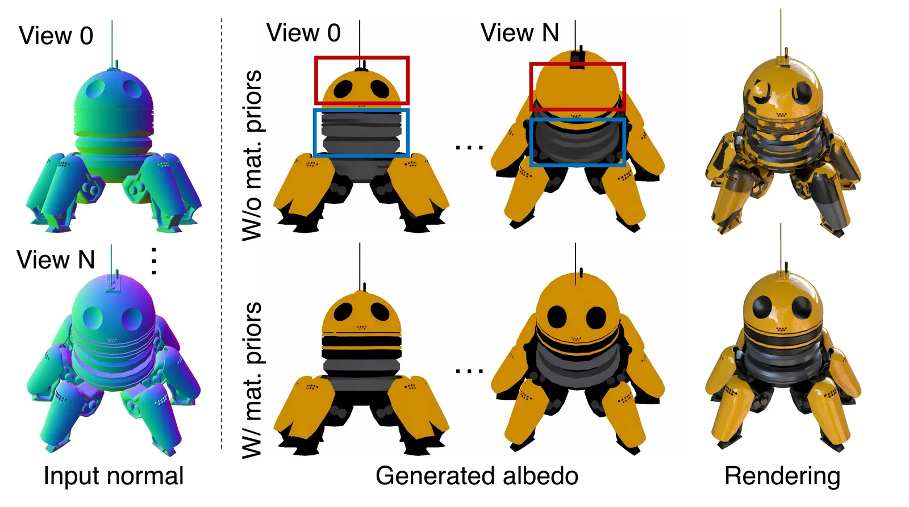
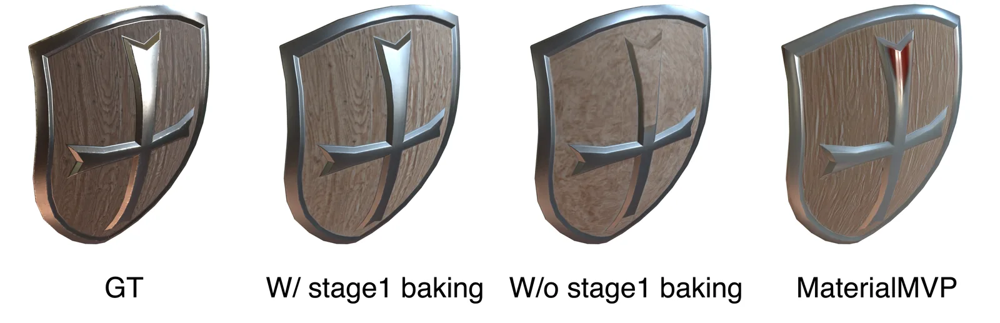
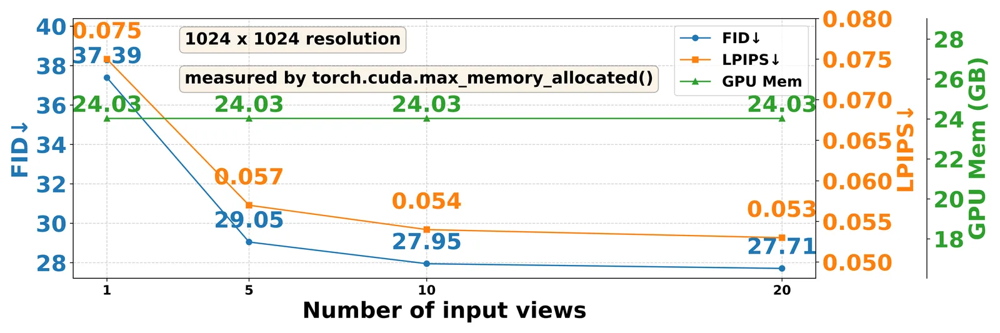

> 论文：MatMart: Material Reconstruction of 3D Objects via Diffusion  
> 作者：Xiuchao Wu, Pengfei Zhu, Jiangjing Lyu, Xinguo Liu, Jie Guo, Yanwen Guo, Weiwei Xu, Chengfei Lyu  
> 机构：浙江大学、南京大学、阿里巴巴集团  
> 来源：CVPR 2026

## 1. 引言：材质重建为什么难？

从 RGB 图像恢复 3D 物体的材质（Material Reconstruction）是计算机视觉与图形学交叉领域的经典难题。与单纯的纹理贴图不同，PBR 材质需要把表面反射拆解为**反照率（Albedo）、粗糙度（Roughness）、金属度（Metallic）**等物理参数，并保证这些参数在不同视角、不同光照下都能渲染出符合真实物理规律的结果。

传统方法主要依赖可微分渲染进行逐对象优化，往往需要大量采集图像，效率低且不稳定。近年来，扩散模型（Diffusion Models）在材质估计与生成任务上展现了强大潜力，但现有方案仍面临三个核心挑战：

- **高保真细节保留**：物体表面的文字、Logo、精细纹理等语义信息难以被现有生成模型忠实复现。
- **可扩展性**：实际应用需要框架能处理任意数量的输入图像，并支持高分辨率推理，而现有方法常因显存限制无法扩展。
- **系统简洁性**：依赖多个预训练模型或多阶段级联的系统会增加训练与部署复杂度，并可能引入稳定性问题。

MatMart 正是针对上述问题提出的统一解决方案。

## 2. 方法总览：两阶段统一扩散框架

MatMart 的核心思想是把材质重建拆分为两个互补阶段，并在一个扩散模型中统一完成：

### Stage 1：渐进式材质估计（Progressive Material Estimation）

输入一组 RGB 图像，模型逐步估计每张图像对应的 PBR 材质，并将结果烘焙到 UV 空间。这一阶段的目标是在**可见区域**尽可能准确地还原输入图像中的材质细节。

### Stage 2：先验引导的材质生成（Prior-guided Material Generation）

对于单视角或稀疏视角输入，UV 空间中不可避免地存在遮挡或未观测区域。第二阶段利用第一阶段烘焙出的材质作为先验，自适应地选择新的视角，交替进行生成与烘焙，逐步补全缺失区域。

两阶段的优势在于：**先估计、后生成**。Stage 1 负责忠实保留输入细节，Stage 2 负责利用扩散先验补全未知区域，二者各司其职又共享同一模型。

## 3. 关键技术：VMCA 与渐进推理

### 3.1 View-Material Cross-Attention（VMCA）

为了让模型在渐进推理过程中仍保持多视图一致性，作者提出了 **View-Material Cross-Attention（VMCA）**。

传统的跨视图注意力机制需要把所有输入图像同时拼接，空间复杂度为 O(N²)，难以处理高分辨率或大量输入。MatMart 采用**逐轮渐进推理**，每一轮只处理一个目标视图（Target View）和一个参考视图（Reference View）。其中参考视图是**上一轮预测/生成的结果**，这样不同轮次之间就形成了链式的信息传递。VMCA 在目标视图与参考视图之间建立连接：

- Query 来自目标视图；
- Key 和 Value 来自目标视图与参考视图的拼接；
- 参考视图本身不会被目标视图污染，直接作为 Value 输出。

由于每轮参与注意力的视图数量固定为 2，VMCA 的空间复杂度为 **O(1)**，与输入图像总数无关。这意味着 MatMart 可以支持从单张图像到任意多张图像的输入，同时保持显存占用稳定。

### 3.2 自适应视角选择与交替烘焙

在第二阶段，MatMart 不会盲目生成所有视角，而是基于 UV 空间中 texel 的覆盖情况进行自适应视角选择：

1. 以 6 个坐标轴方向视图作为基础视角；
2. 在球面上均匀采样 300 个候选视角；
3. 采用贪心策略，每次选择能最大化 UV 覆盖率的视角；
4. 当覆盖率达到阈值 ρ=0.95 或视角数达到上限 N=10 时停止。

在每次生成时，网络输入除了第一阶段的材质先验外，还包括从已知几何渲染得到的**几何先验**（法线 Normal 与点位置 Point Position），以及标识待生成区域的 Generation Mask。为了提升效率，作者使用基于深度的 Warping 来快速获取这些先验和 Mask。

VMCA 的基本单元仍然是“目标视图 + 参考视图”，但在 Stage 2 中为了提高效率，会把 **3 个目标视图组成一个 Group** 并行推理（Group 大小可根据显存调整）。每轮生成后，结果被投影回 UV 空间，并通过加权混合策略更新已有纹理。权重考虑了视角方向与表面法线的余弦相似度，以降低大角度观察区域的贡献，从而减少烘焙伪影。

### 3.3 统一架构：一个模型同时做预测与生成

MatMart 的另一大亮点是**用单个扩散模型端到端地完成预测与生成**。两个任务的输出都是 PBR 材质，都使用 VMCA 保证一致性，因此可以共享同一个 U-Net 骨干。

具体实现上，作者在预训练 Stable Diffusion 的基础上，每个注意力块包含三层注意力：

- **Cross-component Attention**：在 Albedo 与 Roughness/Metallic 之间交换信息；
- **View-Material Cross-Attention（VMCA）**：保证多视图一致性；
- **Text-prompt Cross-Attention**：通过文本提示控制当前输出是 Albedo 还是 RM。

对于两种任务不同的输入形式，作者用零填充（Zero Padding）对齐张量形状，零填充同时作为任务标识符，让模型区分当前是在做预测还是生成。

## 4. 训练与推理细节

### 训练设置

- 数据集：ABO、G-Objaverse、Arb-Objaverse（与 IDArb 一致）；
- 硬件：16 张 NVIDIA H20 GPU；
- 优化器：AdamW，学习率 1×10⁻⁴；
- 预测目标：v-prediction；
- 训练策略：预测任务与生成任务交替优化；由于渐进估计的第一个视角没有参考视图，作者还专门加入了无参考视图时的预测训练；
- 分辨率：先在 256×256 上训练 20K 步，再在 512×512 上训练 50K 步。

### 推理设置

- 单张 V100 GPU 即可完成推理；
- 推理分辨率：1024×1024；
- 无 UV 的 mesh 使用 Blender Smart UV Project 展开；
- 每物体推理时间约 9–23 分钟，取决于所选视角数量 N。

## 5. 实验结果

### 5.1 定量对比

作者在 Objaverse 子集上选取 100 个物体，每个物体渲染 9 个视角，分别用 1 张和 3 张图像作为输入进行测试。对比方法包括 NvDiffRec、Paint3D、Material Anything、MaterialMVP 以及 Stage1+TexGEN 的组合。

在单视角和多视角设置下，MatMart（1024×1024）均取得了领先的指标：

- **Albedo**：SSIM 和 PSNR 明显优于基线；
- **Roughness/Metallic**：MSE 更低；
- **渲染真实感**：FID 和 LPIPS 显著下降。

值得一提的是，高分辨率推理（1024×1024）相比 512×512 带来了进一步提升，验证了 MatMart 在高分辨率下仍能有效对齐几何与纹理细节。

### 5.2 定性对比

从可视化结果看，MatMart 能更好地保留输入图像中的语义细节，例如蓝色包上的图标、花瓶上的文字等。相比之下：

- NvDiffRec 在稀疏视角下难以解耦材质与光照，渲染偏噪；
- Paint3D 容易把阴影和反射烘焙进纹理；
- MaterialMVP 虽然视觉效果不错，但会丢失输入中的细节；
- Material Anything 在多视图之间存在接缝或不一致；
- TexGEN 直接在 UV 空间生成，受限于网络分辨率，容易出现模糊和颜色错误。

在真实世界数据集 Stanford-ORB 上的测试也表明，MatMart 具有较好的泛化能力。

### 5.3 消融实验

作者对三个核心设计进行了消融：

- **VMCA**：去除后多视图一致性明显下降，最终渲染质量变差；
- **Material Priors**：若把 Stage1 提供的材质先验置黑，生成结果在不同视角间出现明显不一致；
- **Stage1 Baking**：跳过第一阶段直接从头生成，重建质量大幅下降，说明先估计再生成的策略至关重要。

此外，实验还发现：随着输入视角数量增加，重建质量持续提升，但在约 10 个视角后趋于饱和；同时 GPU 显存占用始终维持在约 24 GB，不随输入视角数量变化，充分体现了框架的可扩展性。

## 6. 局限性与未来方向

作者在结论中也坦诚了当前方法的局限：

1. **材质分解的固有歧义性**：可能导致预测的反照率存在整体颜色缩放；
2. **强自遮挡物体**：可能需要更多视角才能获得满意的生成效果。

这些问题也是整个逆渲染领域面临的共同挑战，值得后续研究继续探索。

## 7. 总结

MatMart 通过**两阶段重建 + 渐进推理 + VMCA + 统一单模型**的组合，为 3D 物体 PBR 材质重建提供了一个兼顾高保真、可扩展与易部署的解决方案。它既能在可见区域忠实保留输入细节，又能利用扩散先验补全未知区域，同时在显存占用上实现了与输入视角数量无关的 O(1) 复杂度。对于从事 3D 重建、逆渲染、数字资产生成的研究者和工程师来说，MatMart 提供了一个值得关注的新范式。
