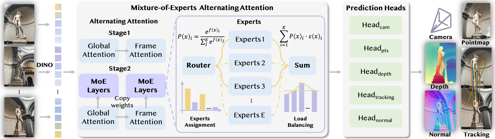
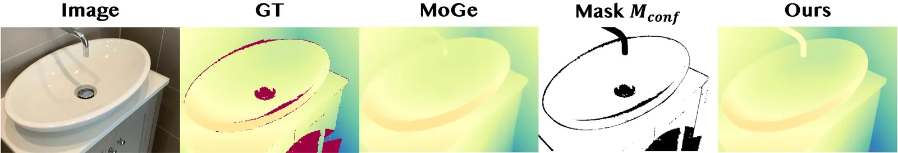
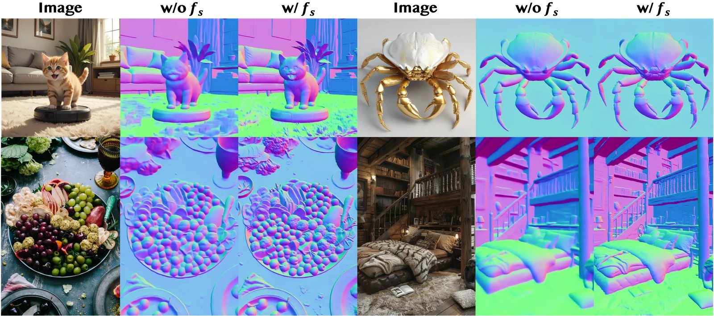
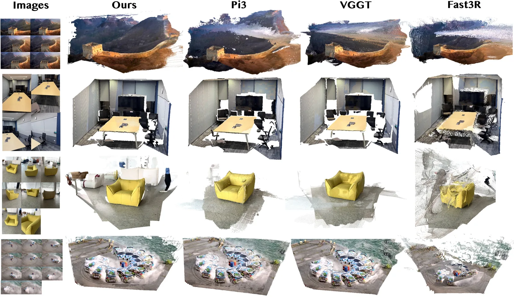
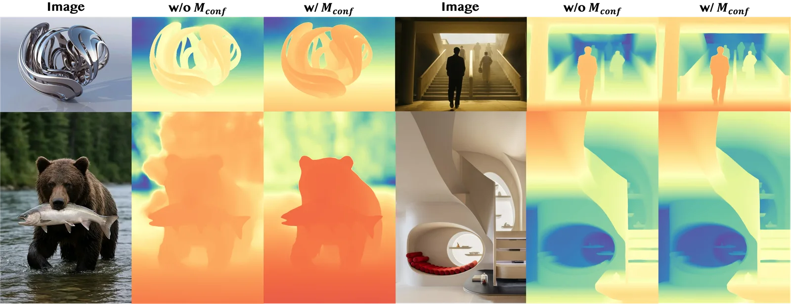

> 论文：MoRE: 3D Visual Geometry Reconstruction Meets Mixture-of-Experts  
> 作者：Jingnan Gao, Zhe Wang, Xianze Fang, Xingyu Ren, Zhuo Chen, Shengqi Liu, Yuhao Cheng, Jiangjing Lyu, Xiaokang Yang, Yichao Yan  
> 机构：上海交通大学、阿里巴巴集团  
> 来源：CVPR 2026

<figure>
  <video src="/Taobao3D/blog/more/video.mp4" controls preload="metadata" playsinline></video>
  <figcaption>MoRE 效果演示</figcaption>
</figure>

## 从“单点优化”到“基础模型”

过去几年，GPT、CLIP、DINO、Stable Diffusion 等基础模型已经证明：只要数据和模型容量足够大，神经网络就能学到跨任务、跨场景的通用表示。3D 视觉几何重建也在经历同样的范式转移——从“每个场景单独优化”走向“前馈式（feed-forward）统一重建”。DUSt3R、MASt3R、Fast3R、VGGT 等模型已经让我们看到，大规模预训练可以赋予模型强大的几何先验。

但 3D 模型的进一步放大并不容易：几何监督信号复杂、真实训练数据噪声大、场景分布极其多样（室内、室外、物体、人物、动态）。上海交通大学与阿里巴巴联合提出的 **MoRE**，正是为了破解这些瓶颈。它将 **混合专家模型（Mixture-of-Experts, MoE）** 引入 3D 视觉几何重建，构建了一个能同时输出点云图、深度图、相机位姿、跟踪特征和表面法向量的统一基础模型。

## MoRE 的核心架构：Transformer + MoE

MoRE 以密集视觉 Transformer 为骨干，并在一系列几何预测头上扩展了 MoE 机制。输入是一组未知相机参数的 RGB 图像，输出则包括：

- 相机内参与外参（Camera）
- 逐像素 3D 点图（Pointmap）
- 深度图（Depth）
- 跟踪特征（Tracking）
- 表面法向量（Normal）

*图 1. MoRE 采用两阶段训练：第一阶段使用多任务目标训练密集 Transformer；第二阶段引入混合专家（MoE），让不同专家专注于不同场景与任务，实现可扩展且高效的几何预测。*

MoE 层的核心思想是“条件计算”：对每个 token，路由器会预测其应该被送往哪些专家，然后只激活 top-K 个专家进行加权聚合。这样，模型总参数量可以很大，但每次前向激活的参数却很少。更重要的是，不同专家可以自然分工——有的擅长室内结构，有的擅长室外大场景，有的专攻物体细节——从而提升对多样化 3D 数据的适应能力。为了让专家负载均衡，MoRE 还引入了可微分的负载均衡损失，避免所有 token 都涌向少数“热门”专家。

在训练稳定性上，MoRE 基于 VGGT 预训练权重初始化，并使用了自适应损失截断策略：维护近期损失的均值与标准差，当某一步损失超过 μ + 3σ 阈值时会被裁剪，从而避免偶发的异常样本主导梯度。训练数据覆盖了室内、室外、以物体/人物为中心以及动态场景，确保模型在真实应用中的泛化能力。

## 两项关键技术：让真实数据与精细几何更可靠

### 1. 基于置信度的深度精炼

真实世界深度训练数据常常带有噪声或缺失值，如果直接用这些标签监督，模型容易过拟合到错误的深度上。MoRE 的做法是：先用当前最强的单目深度模型 MoGev2 预测深度，再与真实深度比对，生成一个置信度掩码 M_conf，只保留高置信度区域参与监督。

*图 2. 引入置信度掩码后，模型能够忽略真实深度标签中的噪声（如红色区域），从而得到更清晰、更准确的深度估计。*

这一先验引导的深度损失与原有的多视图深度损失结合，显著提升了深度估计的稳定性和精度。

### 2. 密集语义特征融合

多视图重建模型往往倾向于生成平滑、一致但细节不足的几何；而单目模型细节丰富却缺乏全局一致性。MoRE 将全局对齐的 3D 骨干特征与每张图像的 DINOv2 密集语义特征相融合，再输入法向量预测头。这样，模型既能保持多视图一致性，又能捕捉到物体表面的精细结构。

*图 3. 加入密集语义特征（w/ f_s）后，法向量预测在毛发、金属、织物等细节区域明显更清晰、更准确。*

## 实验结果：多项基准刷新 SOTA

MoRE 在点云图估计、单目深度估计、相机位姿估计和表面法向量估计等任务上进行了系统评估，均取得了领先或极具竞争力的结果。

*图 4. 与 Pi3、VGGT、Fast3R 等方法的定性对比显示，MoRE 在长城、会议室、沙发、赛车等场景中都能重建出更完整、更一致的几何。*

*图 5. 消融实验进一步说明，置信度深度精炼模块能够让模型在高光、透明或低纹理区域保持更稳定的深度估计。*

## 写在最后

MoRE 展示了 MoE 架构在 3D 视觉几何重建中的巨大潜力：它不仅能像大语言模型一样“用更少激活参数换取更大模型容量”，还能让不同专家自动适应多样化的 3D 场景。结合置信度深度精炼与密集语义特征融合，MoRE 在多个主流基准上刷新了最优结果，为 AR/VR、游戏内容生成、机器人感知和自动驾驶等应用提供了一个更可扩展、更鲁棒的 3D 视觉基础模型。
