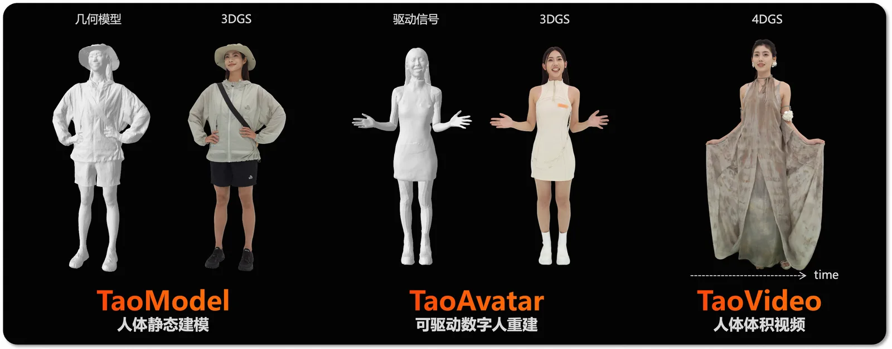
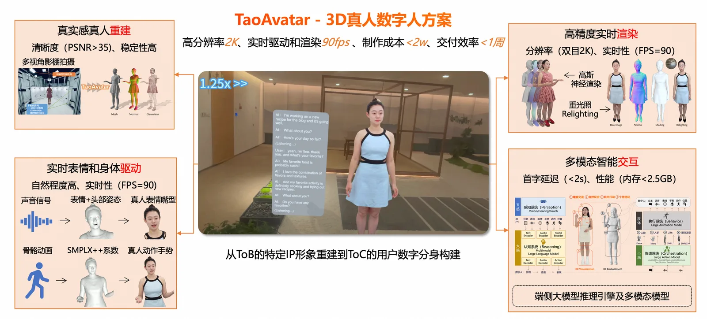
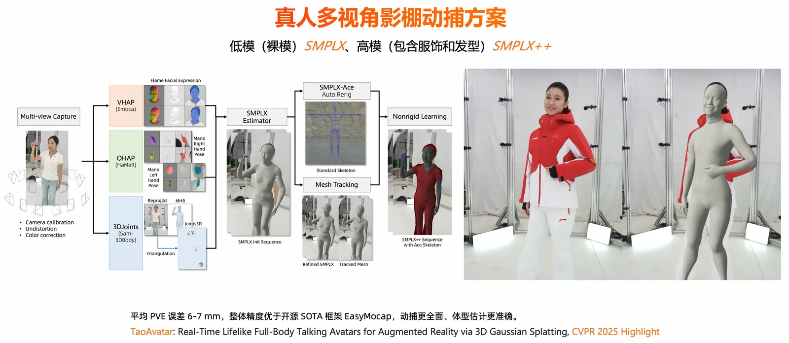
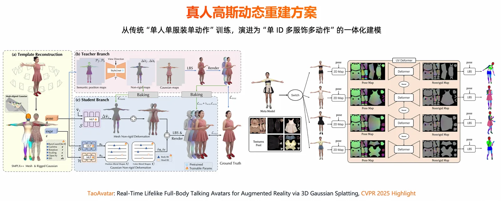
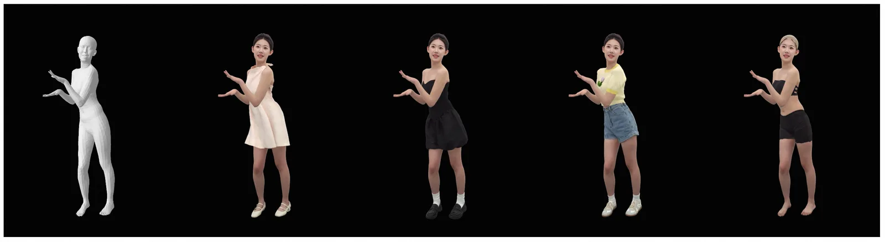
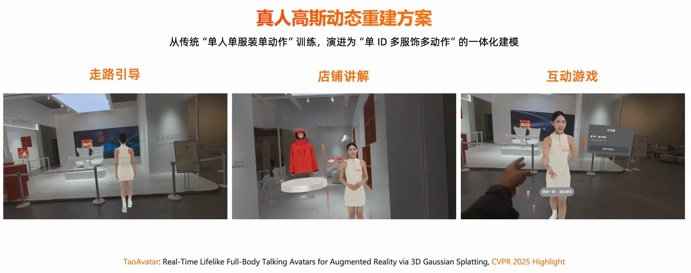
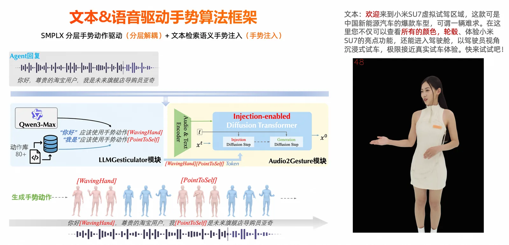
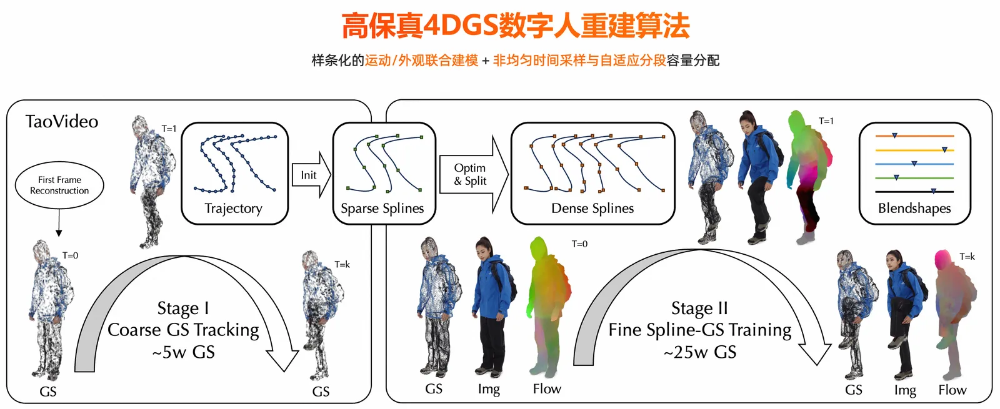
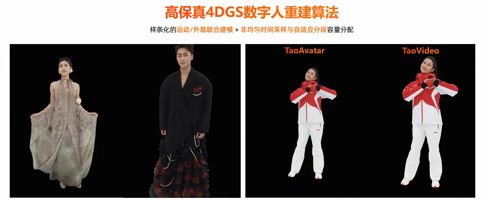
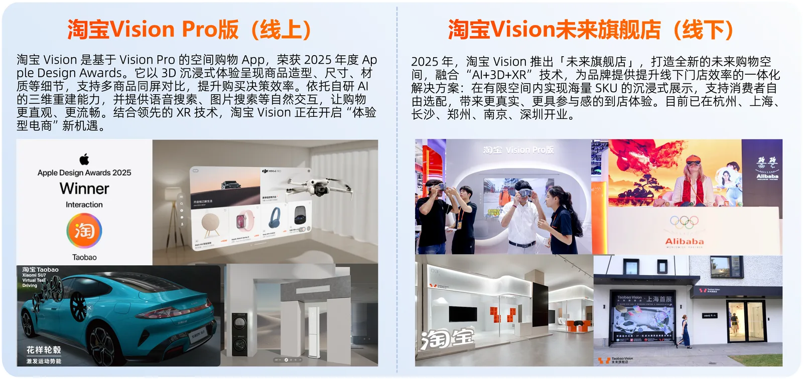

TaoAvatar 3D 数字人技术已经推出 1 年多时间，借这个节点回顾一下我们这一整年做的技术演进和典型业务形态尝试。

在具体的品牌合作案例中，淘宝 Vision 未来旗舰店 3D 智能导购已经在上海、杭州、南京、长沙等多地稳定运营；伯希和虚拟服装店提供了 3D 人工智能导购和多模态智能问答服务；此外，团队还为米兰冬奥会打造了服饰数字人，在意大利米兰开设了虚拟服装店，提供 3D 服饰模特展示。

<figure>
  <video src="/Taobao3D/blog/taoavatar/1.mp4" controls preload="metadata" playsinline></video>
  <figcaption>淘宝 Vision 未来旗舰店 3D 智能导购</figcaption>
</figure>

<figure>
  <video src="/Taobao3D/blog/taoavatar/2.mp4" controls preload="metadata" playsinline></video>
  <figcaption>淘宝 Vision 伯希和 3D 虚拟服装导购</figcaption>
</figure>

<figure>
  <video src="/Taobao3D/blog/taoavatar/3.mp4" controls preload="metadata" playsinline></video>
  <figcaption>淘宝 Vision 米兰冬奥会 3D 服饰数字人</figcaption>
</figure>

## 一、数字人的多元风格与应用场景

数字人的风格非常多样。比如现在比较常见的偏轻量化的 2D 数字人，也有基于视频生成或视频驱动的视频数字人——最近像 Seedance、LPM 这类工作都非常火，代表了视频数字人在表现力和生成效率上的快速提升。如果进一步往 3D 方向看，像 Meta 的 Codec Avatar 也在往 3D 生成和驱动大模型方向上走，追求更低成本的生成和部署。数字人的形态很多元，涵盖二次元、超写实、真人等不同风格，其应用领域包括影视、游戏、通信、电商等，前景广泛。

## 二、TaoAvatar 技术体系总览

2025 年淘天集团推出了 TaoAvatar 这样一种 3D 真人数字人形态，并且已经在 XR 眼镜端做出了完整体验。今年 TaoAvatar 的发力方向主要有两个：第一，继续扩充它能支持的形象和服饰类型；第二，围绕一些重点数字人 IP，提升它们可驱动动作的丰富度和质量。

具体来说，团队现在主要有三类能力：

- **TaoModel——3DGS 人体静态建模**。通过标定、分割、几何重建和高斯静态重建，快速生成高质量的 3D 人体静态模型。它一方面可以帮助业务方快速预览建模效果，另一方面在一些特定场景下也可以直接作为最终交付物使用。
- **TaoAvatar——3DGS 可驱动数字人重建**。基于多视角拍摄、SMPLX++ 几何重建和 3DGS 动态重建，生成可以被语音、手势、动作等方式驱动的 3D 真人数字人资产。目前它对素材还有一定要求，比如服饰需要相对紧身、动作幅度不能太大、手部末端要尽量清晰可见。
- **TaoVideo——4DGS 人体体积视频**。支持任意服饰、发型和身材的模特拍摄，并通过时间轴做动态重建，比较完整地记录像裙摆这类复杂动态效果，能给业务创意带来更大的空间。当然，这类方案需要在重建质量和存储成本之间做一定平衡。

## 三、核心技术详解

### 3.1 3D 真人数字人技术框架

TaoAvatar 是一套基于 3D Gaussian Splatting（3D 高斯泼溅技术）的 3D 真人数字人方案。它主要解决传统 3D 建模里几个比较典型的问题：计算量大、细节还原不够，以及在移动端运行比较困难。

在能力上，TaoAvatar 集成了 3D 高斯重建、语音口唇驱动、身体姿态和手势驱动、端侧实时渲染，以及大语言模型推理引擎 MNN-LLM。基于这些能力，它可以服务电商导购、虚拟陪伴等场景，提供更拟真的数字人形象。

这里也补充一下为什么选择用 XR 设备来呈现。因为人眼本身就是天然双目的，XR 设备更能体现 3D 数字人的立体感。而在目前的眼镜设备里，Apple Vision Pro 在分辨率和稳定性上表现比较好——虽然它也有一些问题，但现阶段来看仍然是比较适合呈现这类体验的设备。

TaoAvatar 的核心技术指标包括：清晰度 PSNR 大于 35、稳定性高；实时表情和身体驱动，自然程度高、实时性达到 90 FPS；高精度实时渲染，双目分辨率 2K、实时性 90 FPS；多模态智能交互，首字延迟小于 2 秒、内存占用小于 2.5GB。整体方案实现了高分辨率 2K、实时驱动和渲染 90 FPS、制作成本低于 2 万元、交付效率低于 1 周，并且已经从 ToB 的特定 IP 形象重建扩展到 ToC 的用户数字分身构建。

### 3.2 真人体型和动作捕捉

TaoAvatar 的第一个算法核心是真人体型和动作捕捉。它的输入是多视角视频，输出的是和被拍摄者体型、姿态一致的 SMPLX 动捕数据，这些数据可以直接用来驱动 3DGS 数字人。

团队在 SMPLX 基础上做了几层扩展：SMPLX++ 用来表达头发和服饰 Mesh 的非刚性形变；SMPLX-Ace 用来做自动骨骼绑定；再通过 Retargeting，把动捕演员的动作迁移到目标数字人身上。

具体算法流程上，会逐帧提取分层监督信号：脸部用 EMOCA，手部用 HaMeR，身体用 SAM-3DBody 的 3D 关键点。然后先优化每一帧的 SMPLX 初值，再结合图像和监督信号做 mesh tracking，保证时序平滑、减少抖动（Tracking 模型还提供了非常丰富的语义 parsing 结果）。最后再基于图像学习服饰 Mesh 的非刚性形变，产出最终的 SMPLX++ 动捕数据。

这里有两个比较关键的创新点：第一是脸、手、身体分层解耦监督，分别约束再做时序跟踪，让动捕结果更稳定；第二是小棚和大棚联动——大棚负责大范围动作驱动，小棚负责叠加非刚性形变，从而实现跨棚一致的迁移和驱动。

在大小棚联动上，具体做法是：小棚先用 1 帧重建锁定统一的骨架和体型，大棚再复用这套骨架和体型去采集更大范围的动作。同时，为了增强稀疏视角下的 tracking 稳定性，要求至少 5 个全身可见视角来稳定身体绑定，至少 3 个手部可见视角来稳定手势绑定。效果上，客观指标显示平均 PVE 误差在 6 到 7 毫米，整体精度优于开源 SOTA 框架 EasyMocap，动捕更全面，体型估计也更准确。

### 3.3 真人动态重建

再讲一下 TaoAvatar 在可驱动 3DGS 数字人重建上的新思路。团队之前的核心做法，是通过教师-学生框架、轻量化设计，以及非刚性形变烘焙和轻量化 BS 补偿，让数字人资产既能保持较高清晰度，又能控制资产大小，从而实现端侧实时渲染。

但新的问题是：同一个数字人 ID，如何支持不同服饰、不同动作的统一驱动。为了解决这个问题，团队从过去的「单人、单服装、单动作片段」的训练，升级到「单 ID、多服饰、多动作」的一体化建模。

具体来说，会先基于多视角影棚数据，对同一个 ID 采集多套服饰和多段动作，完成 SMPLX++ 绑定和 tracking。然后通过人体部件 Parsing，把身体、服饰、发型等区域做细粒度分割，并在 UV 空间里统一学习肌肉和服饰的非刚性形变。不同服饰之间可以共享权重，实现跨服饰复用。

最后，会把这些形变通过 PCA 烘焙成端侧可实时运行的几何形变场和高斯形变场。这样在推理时，只要输入这个 ID 的姿态驱动信号，就可以驱动它在不同服饰下产生自然运动，包括肌肉形变和服饰形变。整体资产规模大约 400MB，并且可以在端侧做到 90 FPS 的实时推理和渲染。

展示效果方面，团队展示了不同 Pose 下衣服几何的非刚性形变效果，以及用同一组驱动信号驱动相同 ID 不同服饰的效果。虽然还是会有一些穿模，但整体的驱动效果是比较一致的。

同时也展示了在相同 ID、相同服饰但不同动作下的驱动效果，包括走路引导、互动游戏、店铺讲解等应用场景。

### 3.4 真人语音驱动手势

这里讲一下 TaoAvatar 的语音和文本驱动手势算法框架。简单来说，系统接收语音和文本输入后，会生成两类动作：一类是基础手势，比如说话时自然的节奏型肢体反应；另一类是强语义手势，也就是根据文本含义触发特定动作，最后再通过 SMPLX 驱动 3DGS 数字人。

在算法上，基础手势主要由 GestureDiT 生成，它会结合语音和文本特征，对 SMPLX 人体结构做分层建模：先生成上半身动作，再预测手指姿态，下半身则根据上半身动作条件化生成。这样可以让「原地讲话」场景下的动作更自然、更稳定。

对于强语义手势，团队会用 Qwen-LLM 理解文本内容，检索匹配的预制语义动作，并在 GestureDiT 的去噪过程中注入进去，让数字人在说到关键语义时能做出更匹配的手势。

训练上，团队使用了单目视频动捕数据和 3D 影棚多模态数据。推理时，模型一次预测 1 秒的动作，并且可以实时运行，RTF 小于 1，在 3090 这类消费级显卡上也能部署。效果上，系统在相同语义下用中文和英文表达都能生成对应的手势效果。

### 3.5 TaoVideo：真人 4DGS 体积视频

最后讲一下 TaoVideo-4DGS 人体体积视频重建。它的特点是输入多视角视频，不限制人物和服饰，也不依赖 SMPLX 这类显式人体模型，直接输出一段 4DGS 动态重建序列。

核心思路是把高斯点的运动和外观都做成「样条曲线」。运动上，用样条曲线来描述高斯点的位置和旋转变化；外观上，也用样条来描述颜色变化，并加入生命周期机制，表示高斯点什么时候出现、什么时候消失。这样就能更好地还原衣服飘动、裙摆变化这类复杂动态。

同时，团队引入了非均匀时间控制点和自适应分段建模。简单说，就是动作快、细节多的地方分配更多控制点和高斯容量，动作慢的地方就减少冗余，从而在质量和存储之间取得平衡。

训练上，一段 20 到 25 秒的多视角视频会先用静态 3DGS 初始化，再通过 coarse-to-fine 的方式逐步优化动态细节。推理时，端侧可以实时渲染到约 90 FPS，单段资产在 FP16 存储下大约 400MB。整体来看，这个方案更适合任意服饰、复杂外观和动态效果丰富的数字人视频重建。

主观效果上，对帽子、复杂发型及裙摆等宽松服饰的外观细节与摆动形变刻画稳定，资产内部无明显闪烁。客观指标方面，TaoVideo 平均重建清晰度 PSNR 为 31 至 35，LPIPS 为 0.06 至 0.1。团队也展示了 TaoVideo 和 TaoAvatar 的效果对比，特别是裙摆动态效果方面的差异。

## 四、淘宝 Vision 落地应用

从去年到今年，团队把基于 XR 眼镜的 3D 版淘宝体验，从线上扩展到了线下，在杭州、上海、长沙、深圳等城市陆续开业了淘宝 Vision 未来旗舰店。

淘宝 Vision（线上）是基于 Vision Pro 的空间购物 App，荣获 2025 年度 Apple Design Awards——该奖项设立 36 年来，这是国内互联网平台首次获奖。淘宝 Vision 以 3D 沉浸式体验呈现商品造型、尺寸、材质等细节，支持多商品同屏对比，提升购买决策效率；依托自研 AI 的三维重建能力，并提供语音搜索、图片搜索等自然交互，让购物更直观、更流畅。

淘宝 Vision 未来旗舰店（线下）打造了全新的未来购物空间，融合「AI+3D+XR」技术，为品牌提供提升线下门店效率的一体化解决方案：在有限空间内实现海量 SKU 的沉浸式展示，支持消费者自由选配，带来更真实、更具参与感的到店体验。目前已在杭州、上海、长沙、郑州、南京、深圳开业。

## 五、未来技术演进

相较于影棚拍摄数字人，团队也在探索用单图/稀疏视角的低成本数字人生成方案，进一步降低门槛、扩大规模。

今年 CVPR 团队提出了 FHAvatar：从任意数量的视角快速重建可组合的 3D 高斯人头，并把人脸和头发在纹理空间拆开建模——面部用平面高斯，头发用 Strand 高斯。只要少量照片，几分钟就能做出高质量结果，还能实时驱动表情嘴型、轻松换发型、做风格化编辑等。
