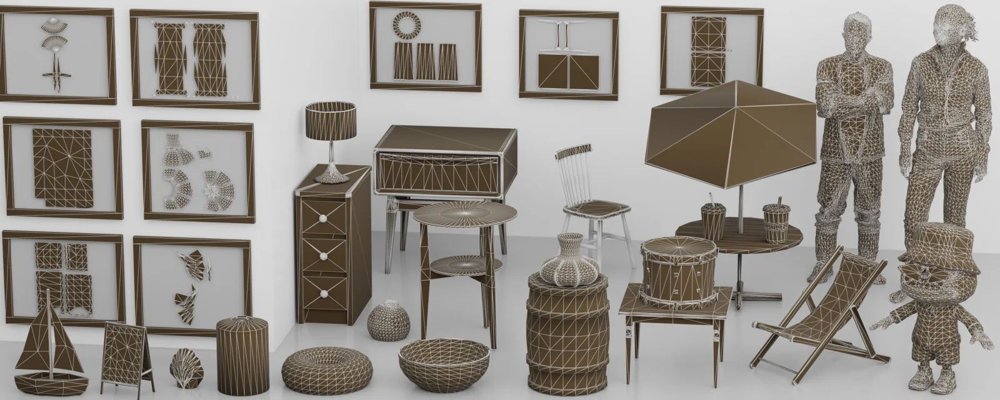
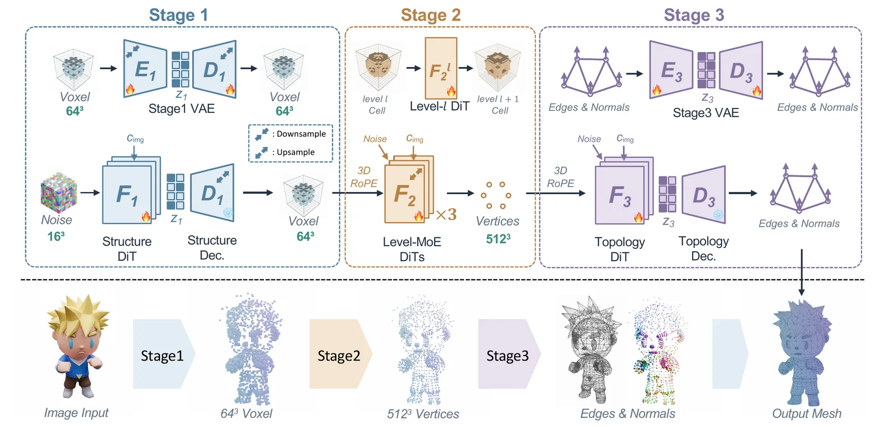
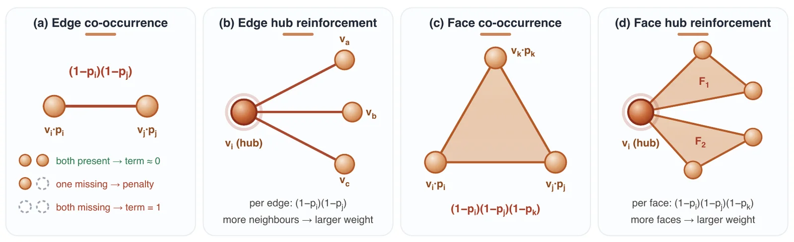
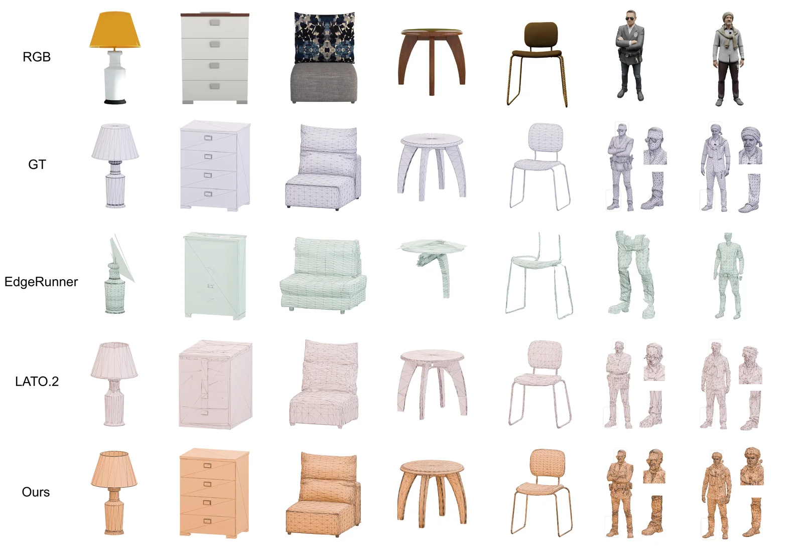
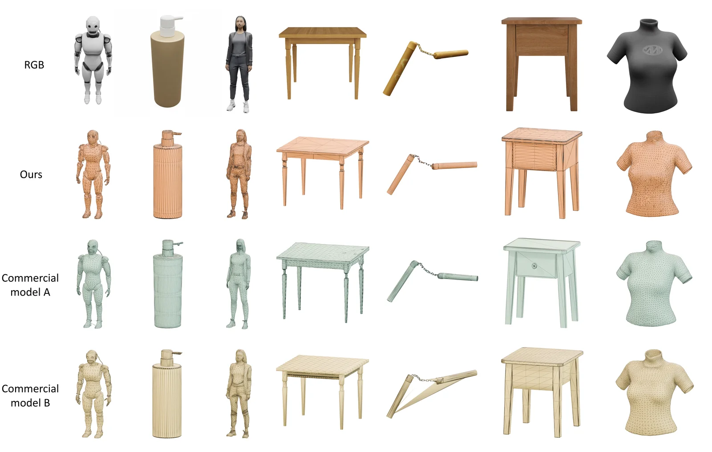
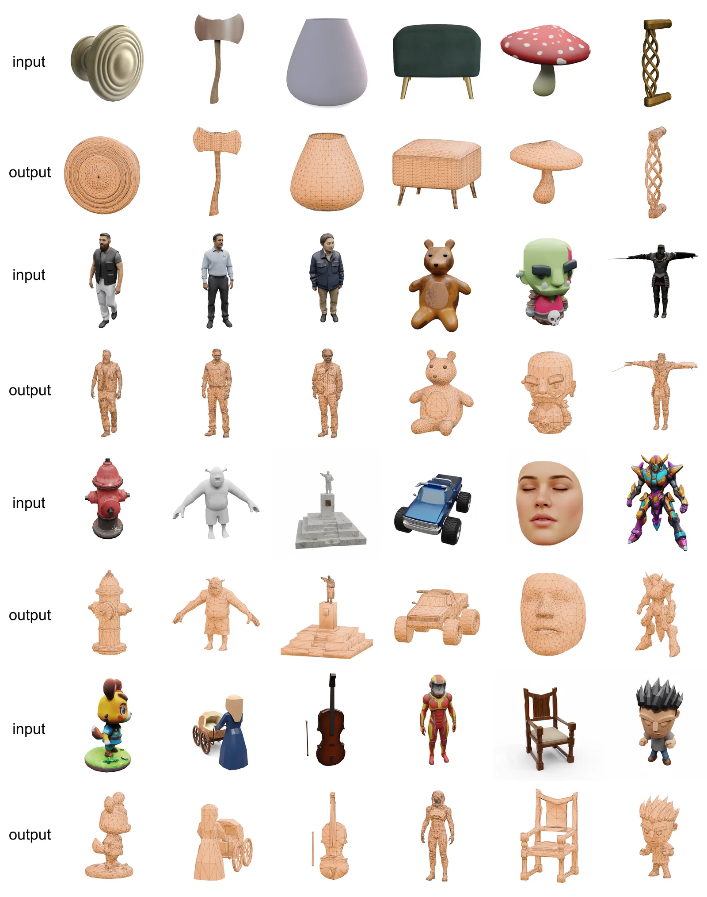
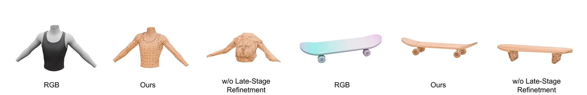

> 论文：TaoFlowForge: Progressive Native Mesh Generation via Cascaded Flow Matching  
> 作者：Xianze Fang\*, Qiyuan Feng\*, Dongfang Sun, Yan Zhang, Xiuchao Wu, Jingnan Gao, Jiangjing Lyu†, Chengfei Lyu†, Gang Yu  
> 机构：Taobao3D Team, Alibaba Group

## 1. 引言：为什么生成"生产级"网格这么难？

三角网格（Triangle Mesh）是现代 3D 生产管线的基础——无论是骨骼绑定、动画制作、渲染引擎还是实时部署，都离不开它。基于图像的 3D 网格生成模型能极大简化设计师的工作流，但并非所有生成的网格都能直接投入生产使用。

基于 SDF（符号距离场）表示的方法通常会产生面数极高、拓扑结构混乱的网格，主要面临三大挑战：

- **UV 展开困难**：复杂拓扑卡住整个生产管线。
- **存储开销大**：沉重资产无法在端侧实时渲染。
- **拓扑不规则**：给下游的骨骼绑定和动画制作带来极大困难。

这些问题在大规模电商平台上尤为突出。在淘宝的实际业务中，3D 资产承载着 Vision Pro 沉浸式购物和移动端 AR 摆放等交互体验，对网格质量有着严格的要求。

近年来也出现了两类替代方案——自回归方法逐步生成顶点和面，扩散方法直接生成 3D 基元。然而，自回归方法推理效率低且丢弃了固有的 3D 结构信息；现有扩散方法则在顶点生成稳定性或面朝向预测上仍有不足。

**TaoFlowForge** 正是为了解决上述问题而提出的。它是一个面向原生生产级 3D 内容生成的基础模型，能够生成轻量、可编辑且拓扑干净的网格。

## 2. 方法总览：三阶段级联生成流程

TaoFlowForge 将网格生成分解为**顶点生成**和**连接预测**两部分，组织为三个级联的、基于图像条件的阶段：

### Stage 1：粗结构生成

给定输入图像，TaoFlowForge 首先在 64³ 分辨率下生成粗量化的顶点位置。占据 VAE 将 64³ 体素网格压缩到紧凑的潜空间，一个约 13 亿参数的潜空间 Flow DiT 基于冻结的 DINOv3 图像特征生成粗结构。该阶段从预训练权重（Trellis.2）初始化，有效复用了已学习的图像到粗结构的先验知识。

### Stage 2：后期渐进精炼

这是 TaoFlowForge 的核心差异化设计。Stage 2 直接在无压缩的占据空间中操作（不使用 VAE），采用三个参数独立的 Transformer 专家，分别负责 64³→128³、128³→256³ 和 256³→512³ 三级提升。每个专家专注于自己分辨率层级的占据统计特性。

关键创新在于**归一化原始空间流匹配**：由于二值占据目标的统计特性随分辨率急剧变化，TaoFlowForge 用每个层级自身的伯努利统计量对目标做白化处理，使目标具有零均值和单位方差，从而与高斯源分布对齐。

### Stage 3：联合连接与法向量预测

基于 Stage 2 输出的精炼顶点，Stage 3 同时预测顶点连接关系（边）和逐顶点法向量。一个拓扑 VAE 为每个顶点学习连续特征，潜空间 Flow DiT 通过体素 RoPE 注入顶点坐标来生成这些特征。

连接预测头采用了精巧的**非对称双线性评分**设计：传统的对称内积会错误地鼓励传递性连接（A 连 B、B 连 C 就暗示 A 连 C），而 TaoFlowForge 将每个顶点分别投影到"源"和"目标"两个不同子空间后再计算对称化得分，避免了虚假边的产生。

面的朝向则通过比较每个恢复三角面的几何法线与预测的顶点法线来确定，无需后处理矫正。

## 3. 关键技术创新

### 3.1 拓扑感知损失函数

标准的逐体素二元交叉熵独立处理每个体素，忽略了网格连接结构。TaoFlowForge 引入了两种几何感知的共占据先验：

- **边端点先验**：一种 soft-OR 惩罚，仅当真实边的两个端点都被预测为空时才增长——将网格连接性注入为占据先验。重要的是，这种设计自然地对高度顶点（邻居更多的顶点）赋予更大的权重，加强对结构关键点的监督。
- **面顶点先验**：将同样的 soft-OR 逻辑扩展到每个真实面的三个顶点。

结合边界感知加权二元交叉熵（对假阳性集中的薄表面带进行上加权），这些损失确保生成的顶点集忠实地保留了网格的结构完整性。

### 3.2 后期渐进精炼 vs. 直接生成

两阶段由粗到精的顶点生成是一个关键设计决策。另一种方案——在单阶段中直接生成 512³ 的顶点——会同时降低全局结构和细节质量。渐进式方法保留了 Stage 1 建立的全局布局，而 Stage 2 在此支撑下添加精细顶点，产出比直接高分辨率生成更稳定的结构。

### 3.3 大规模数据策展

TaoFlowForge 在一个大规模且多样化的网格数据集（约 80 万个网格）上训练，来源包括三个互补部分：

1. **淘宝内部 3D 数据集**：以日常室内商品和角色模型为主。
2. **手工制作内部数据集**：补充目录中稀疏的类别。
3. **公开数据集**：Objaverse 和 TexVerse。

多阶段策展管线对原始数据进行过滤：按面数分桶实现均衡采样；拓扑统计筛选（非流形面、顶点度分布、空间均匀性）；最后用基于 VLM 的智能体检查渲染视图，剔除残余低质量样本。

## 4. 实验结果

### 4.1 定量对比

TaoFlowForge 在公开的 Toys4K 基准和 TE-388 数据集（388 个手工制作样本，涵盖室内、室外和角色类别）上与两个代表性的开源原生网格生成方法进行对比：LATO.2（扩散方法）和 EdgeRunner（自回归方法）。

在单图条件生成下，TaoFlowForge 在**全部六项指标**上均达到最优——Chamfer 距离（CD）、Hausdorff 距离（HD）、ULIP-I、Uni3D-I、FD-Inception 和 FD-DINOv2——横跨两个基准。例如，在 Toys4K 上，TaoFlowForge 将 CD 从 0.1553（LATO.2）降至 **0.0655**，FD-DINOv2 从 616.42 降至 **197.73**。

### 4.2 与开源方法的定性对比

EdgeRunner（自回归方法）倾向于输出平滑的凸包，三角化不规则，且经常丢失纤细或拓扑孤立的结构——四肢缺失、头发坍缩为单层壳体、精细面部特征被模糊化。LATO.2（扩散方法）在全局形状恢复上较好，但 TaoFlowForge 的局部三角化更干净，纤细的分支结构保留更完整。

### 4.3 与商业模型的对比

与领先的商业闭源模型相比，TaoFlowForge 在整体几何质量、精细结构保留和拓扑保真度方面依然极具竞争力。

### 4.4 更多结果展示

### 4.5 消融实验

消融实验验证了两个关键设计：

- **后期渐进精炼**：用单阶段直接生成替代由粗到精的级联，全局结构（如滑板几何）和局部细节（如轮子保真度）均明显退化。
- **归一化目标与几何感知损失**：移除任一组件都会导致全部六项评估指标的可衡量下降。

## 5. 总结

TaoFlowForge 提出了一个渐进式原生网格生成框架，作为淘宝 3D 管线的基础模型。通过三阶段级联设计——粗结构生成、后期渐进精炼、联合连接与法向量预测——它能够生成拓扑干净、面朝向正确、几何细节丰富的生产级网格。

拓扑感知损失、非对称双线性边评分以及精心策展的 80 万网格训练数据集的组合，使 TaoFlowForge 在开源方法中达到最优水平，并与商业闭源方法保持竞争力。展望未来，TaoFlowForge 可以应用于更广泛的生成管线，例如作为大规模多模态模型的组件、基于场景图生成 3D 场景，或者基于展开结果生成 UV 空间纹理。
